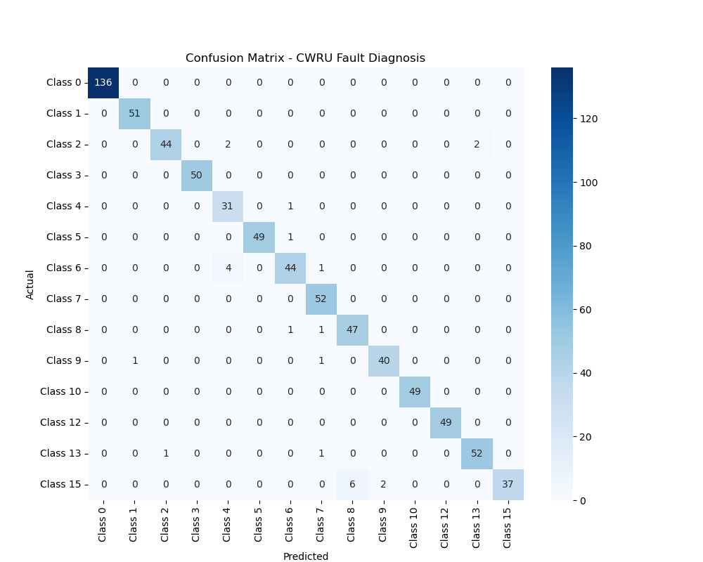

# RmGPT: Foundation Model for Rotating Machinery Diagnosis

## Project Overview

This project implements and reproduces the **RmGPT** (Rotating Machinery
Generative Pre-trained Transformer) framework. It is designed to learn
general physical representations of machinery vibrations through
**Self-Supervised Learning (SSL)** and apply them to downstream tasks
like **Fault Diagnosis** via **Supervised Fine-Tuning**.

**Key Features:** - **Foundation Model:** Uses a Transformer backbone
(MOMENT) pre-trained on diverse industrial datasets. - **Masked Signal
Modeling:** Learns physics by reconstructing masked patches of vibration
signals. - **High Performance:** Achieved **\>98% accuracy** on the CWRU
dataset (14-class fault diagnosis) using the reproduced pipeline.

## Project Structure

``` text
RmGPT/
├── checkpoints/       # Saved models (.pth)
├── dataset_storage/   # Processed .npy data
├── logs/              # SLURM execution logs
├── raw_zips/          # Raw datasets (Zip files)
├── scripts/           # Execution scripts (Slurm & Python)
│   ├── process_manual_cwru.py  # Data Engineering
│   ├── run_pretrain.sh         # Pre-training Job
│   ├── run_finetune.sh         # Fine-tuning Job
│   └── evaluate.py             # Confusion Matrix Generation
├── src/
│   ├── data/          # Dataset Classes (NpyDataset, SupervisedDataset)
│   ├── mymoment/      # Model Architecture (Backbone, Heads)
│   └── training/      # Training Loops (Pretrain, Finetune)
└── README.md
```

## Usage Pipeline

### 1. Environment Setup

``` bash
conda activate moment_env_py311
export PYTHONPATH=$PYTHONPATH:.
```

### 2. Data Engineering

Raw CWRU `.mat` files are manually processed to generate standardized
`.npy` tensors with shape `[2, 2048]`.

``` bash
python scripts/process_manual_cwru.py
```

**Output:**\
Generates `X.npy` and `y.npy` in `dataset_storage/labeled_data/CWRU/`.

### 3. Self-Supervised Pre-Training (Stage 1)

Trains the model to reconstruct masked signals, learning vibration
physics without labels.

``` bash
sbatch scripts/run_pretrain.sh
```

**Output:**\
`checkpoints/rmgpt_pretrain_final.pth`

### 4. Supervised Fine-Tuning (Stage 2)

Loads the pre-trained backbone and trains a classification head for
fault diagnosis.

``` bash
sbatch scripts/run_finetune.sh
```

**Output:**\
`checkpoints/rmgpt_finetune_best.pth` (highest validation accuracy)

### 5. Evaluation

Generates a confusion matrix and classification report.

``` bash
python scripts/evaluate.py
```

**Output:**\
`results/confusion_matrix.png`

## Results Summary

**Experiment:** CWRU Fault Diagnosis (14 Classes)



-   **Pre-training loss:** Converged to ~0.005
-   **Fine-tuning accuracy:**
    -   Train: 100.00%
    -   Validation: ~98.3%

The model successfully distinguishes between normal states, inner race,
ball, and outer race faults across different severities (0.007", 0.014",
0.021").

## Requirements

-   Python 3.11+
-   PyTorch 2.0+ (CUDA supported)
-   HuggingFace Transformers
-   SciPy, NumPy, Pandas, scikit-learn